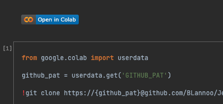
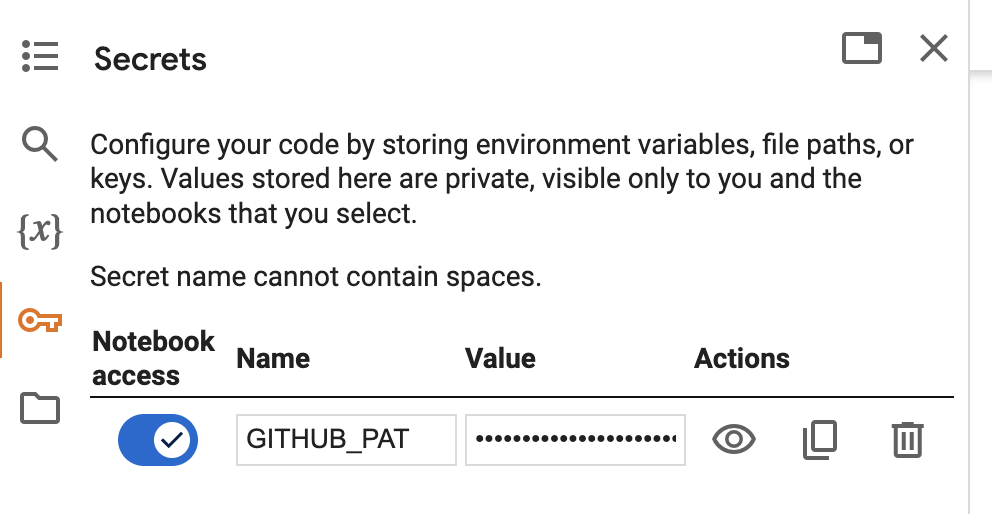
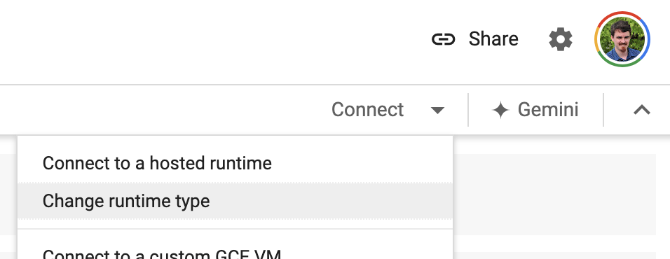
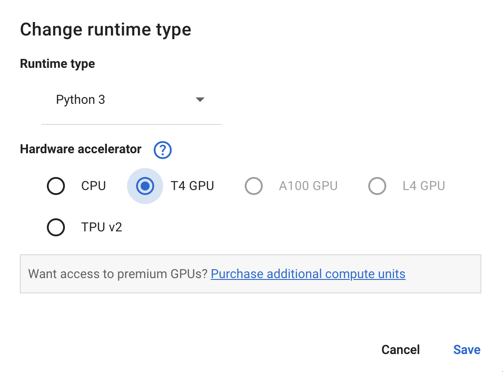

# 2 Setup Google Colab

This document provides instructions for setting up the environment on Google Colab
to run experiments with the provided notebooks.

Using Google Colab is recommended for running larger experiments because of the
availability of GPUs, which can dramatically improve the speed of model execution.

## 2.1 Prerequisites

- A GitHub Personal Access Token (PAT) with access to this repository.

  You can find more details on how to create a PAT in the
  [GitHub documentation](https://docs.github.com/en/github/authenticating-to-github/creating-a-personal-access-token).

  The PAT should have access to this repository.

## 2.2 Steps to Set Up Google Colab

### 2.2.1 Open the Notebook in Google Colab

The notebooks for running experiments are located in the `REPO_ROOT/notebooks` folder.

For example, [`collab-batch-runner.ipynb`](../notebooks/collab-batch-runner.ipynb).

Each notebook contains a Google Colab link at the top.

Click this link to open the notebook directly in Google Colab.



### 2.2.2 Set Up Secrets in Google Colab

The PAT is treated as a secret (`GITHUB_PAT`) in Google Colab.

You can set it up by clicking on the key icon in the Colab interface.

A visual example is provided below:



### 2.2.3 Clone the Repository

To pull the codebase from GitHub, you can use a GitHub PAT,
but the repo was made public now so this is not necessary anymore.

Example code snippet to use the PAT in Colab:

```python
from google.colab import userdata

github_pat = userdata.get('GITHUB_PAT')

!git clone https://{github_pat}@github.com/BLannoo/SLM-Sentiment-Analysis.git
`````

### 2.2.4 Manage Dependencies

The notebooks use `pip-compile` to manage dependencies with constraints from a
`pip freeze`.

This helps maximize compatibility with the current versions of dependencies
available in Google Colab.

To compile the requirements file, freeze the current dependencies, and install them,
run the following commands in the notebook:

```bash
!pip freeze > requirements-collab-freeze.txt
!pip-compile requirements-collab.in -c requirements-collab-freeze.txt > ../pip_compile.log 2>&1
!pip install -r requirements-collab.txt > ../pip_install.log 2>&1
````

Large logs are piped to log files to declutter the output cells.

### 2.2.5 Run Experiments

The last cell in the notebook is configurable for running experiments.

It looks like this:

```python
import time

from src.consts import ModelName
from src.logger import logger
from src.main import main

start_time = time.time()
main(
    model_name=ModelName.QWEN.name,
    prompt_folder_name="./prompts/strategies/",
    start_index=0,
    end_index=100,
    temperatures="0.2,0.8",
)
logger.info(f"Execution time: {(time.time() - start_time) / 60} minutes")
````

Refer to the extensive documentation in `REPO_ROOT/src/main.py` for detailed descriptions
of parameter values.

### 2.2.6 Switch to GPU Runtime in Google Colab

By default, Google Colab uses CPUs for running notebooks. To leverage the power of GPUs and speed up the experiments,
you can change the runtime type to use a **T4 GPU**.

To switch from the default CPU to GPU:

1. Click on the **Connect** button in the top right corner of the Colab interface.
2. Select **Change runtime type** from the dropdown menu.

   

3. In the **Runtime type** dialog, choose **T4 GPU** under the **Hardware accelerator** section.

   

4. Click **Save** to apply the changes.

Keep in mind that the **default setting is CPU**, and switching to a GPU will provide faster computation speeds.
However, note that GPU usage is limited on the free tier of Google Colab, and you may have a limited number of GPU credits.
Consider monitoring your usage to ensure you don’t run out of GPU time.
