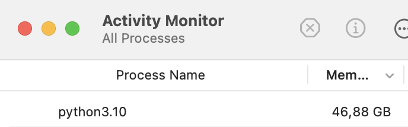

# 4 Running Experiments

This document provides instructions for running batch sentiment analysis on reviews
using different models, temperatures, and prompt templates.

## 4.1 Overview

An experiment is identified by a combination of:

- **Model**: The model used for sentiment analysis, either
  [Qwen/Qwen2-1.5B-Instruct](https://huggingface.co/Qwen/Qwen2-1.5B-Instruct) (`QWEN`)
  or [microsoft/Phi-3-mini-4k-instruct](https://huggingface.co/microsoft/Phi-3-mini-4k-instruct) (`PHI`).

- **Temperatures**: A comma-separated list of float values (e.g., `0.2,0.8`) that control
  the randomness in the model output. Lower values make the output more deterministic, while higher
  values allow for more variability.

- **Prompt**: A folder containing all the prompt templates to be tested during the batch.
  Each prompt file within this folder is used to generate the list of experiments.

- **Device**: The hardware used for running the experiment, automatically detected as one of the following:
  - **CPU (Colab)**: Central processing unit available in Google Colab.
  - **GPU (Colab)**: Graphics processing unit in Google Colab, providing faster computations.
  - **MPS (local)**: Metal Performance Shaders on Mac (local), which is the slowest option, but still faster than a local CPU.

## 4.2 Output Files

Each batch run outputs results in two formats:

1. **CSV File**: Contains detailed results of each experiment for every review analyzed.

   ### CSV Columns:
   - **Experiment Identifiers**:
     - **Model**: The model used for sentiment analysis (`QWEN` or `PHI`).
     - **Temperature**: The temperature setting used for the model run, which affects output randomness.
     - **Prompt Template**: The specific prompt template used in the experiment.
     - **Device**: The hardware used for the experiment (`CPU`, `GPU`, or `MPS`), detected automatically.

   - **Review Details**:
     - **Review ID**: A unique identifier for each review analyzed.
     - **Label**: The true sentiment label of the review (e.g., positive or negative).
     - **Review**: The full text of the review used in the experiment.

   - **Execution Details**:
     - **Run Time**: Timestamp indicating when the experiment started (used as an ultimate identifier).
     - **Execution Time (minutes)**: The total time taken to run the experiment in minutes.
     - **Execution Sentiment**: The sentiment predicted by the model for the review.
     - **Reasoning**: The reasoning provided by the model for its predicted sentiment.

2. **Log File**: Logs the same data as the CSV file, and additional information to the terminal/notebook output cell and a log file.

   - Logs are crucial on Google Colab because disconnections can prevent CSV file access.
     The output cell logs can be copied into a local file if needed.

Both the CSV and log files are saved in subfolders of the `data` folder and are ignored in the git repository.
A log parser script ([src/post/logs_parser.py](../src/post/logs_parser.py)) can recreate the CSV from logs if necessary.

## 4.3 Usage

You can run the `main.py` script using either positional or named arguments.

### 4.3.1 Positional Arguments

To run the script with positional arguments:

```bash
PYTHONPATH=$(pwd):$PYTHONPATH caffeinate python src/main.py QWEN ./prompts/strategies/ 0 100
```

### 4.3.2 Named Arguments

To run the script with named arguments:

```bash
PYTHONPATH=$(pwd):$PYTHONPATH caffeinate python src/main.py \
    -m QWEN -p ./prompts/strategies/ -s 0 -e 100 -t 0.01,0.2,0.8
```

## 4.4 System Requirements and Performance Considerations

Running these experiments on a local machine can consume a significant amount of RAM.
If your device isn't very powerful, consider closing other software to free up resources.

When running on your local machine, it's also advisable to use a tool like **Caffeinated**
to prevent the machine from going to sleep during long-running processes.

### 4.4.1 Example System Performance

The experiments have been successfully run on a MacBook Pro 2017:

- **Processor**: 2.9 GHz Quad-Core Intel Core i7
- **Graphics**: Radeon Pro 560 4 GB, Intel HD Graphics 630 1536 MB
- **Memory**: 16 GB 2133 MHz LPDDR3
- **macOS**: Ventura 13.6.9 (22G830)

While it is possible to run the experiments on a medium-strength machine like this,
it may push the hardware to its limits. For instance, running experiments with MPS (Metal Performance Shaders)
on this system caused RAM usage to spike to **46.88 GB** making heavy use of swap and compressed memory, as shown below:




Given this, a machine with **64GB of RAM** would handle the workload more efficiently,
providing more headroom for memory-intensive operations and reducing the risk of system slowdowns or crashes.

Medium-strength machines can handle these experiments, but adequate hardware resources
are necessary to avoid performance degradation and ensure smooth execution.


## 4.5 Functionality

This script performs sentiment analysis over a range of temperatures specified by the user
or default (0.2, 0.8) for each prompt template found in the specified prompt folder.
The results of each analysis are saved to a CSV file, including columns for
the temperature, prompt template, model, device, and run time.

## 4.6 Examples

### 4.6.1 Positional Arguments

```bash
PYTHONPATH=$(pwd):$PYTHONPATH caffeinate python src/main.py QWEN ./prompts/strategies/ 0 100
PYTHONPATH=$(pwd):$PYTHONPATH caffeinate python src/main.py PHI ./prompts/strategies/ 0 100
````

### 4.6.2 Named Arguments

```bash
PYTHONPATH=$(pwd):$PYTHONPATH caffeinate python src/main.py -m PHI
PYTHONPATH=$(pwd):$PYTHONPATH caffeinate python src/main.py -p ./prompts/strategies/
PYTHONPATH=$(pwd):$PYTHONPATH caffeinate python src/main.py -s 100 -e 200
PYTHONPATH=$(pwd):$PYTHONPATH caffeinate python src/main.py -t 0.01,0.2,0.8
````
