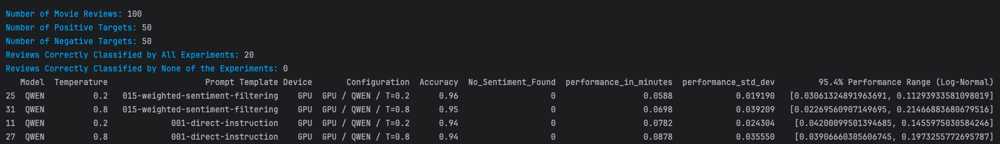
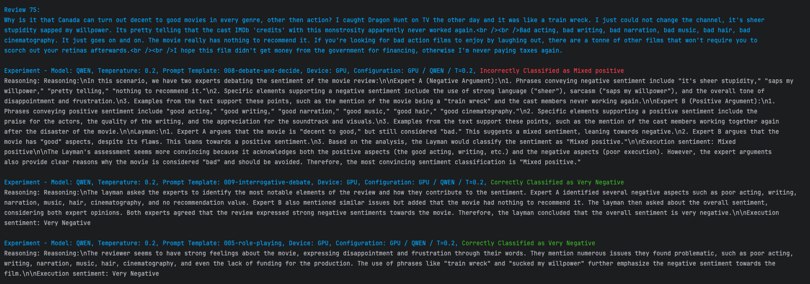

# 5 First Analysis of Experiment Results

This document provides a step-by-step guide to performing an initial analysis of the experiment results
using the provided analysis script.

## 5.1 Overview

After running the experiments, you should have a CSV with the results. These results can be analyzed
to understand the accuracy and compute performance of different experiments
(experiment := model+temperature+prompt_template+device).

The analysis can be performed using the following script: `multi_experiment_analysis.py`

This script helps to aggregate, process, and generate a report of the experiments' outcomes.

## 5.2 Summary Analysis

In the context of this analysis, an **experiment** is defined as a combination of:
- **1 model**
- **1 temperature**
- **1 prompt template**
- **1 device type**

Each experiment is run against a set of reviews. When comparing different experiments, the assumption
is made that all experiments were run on the same reviews.

The summary analysis provides an overview of the performance across different experiments,
comparing metrics such as accuracy, execution time, and variability.

A sample output of the analysis summary looks like this:



## 5.3 Example Analysis for a Single Review

The single review analysis allows for a deeper investigation into why certain experiments performed better or worse.
It focuses on reviews where at least one experiment failed to classify correctly. The output highlights:

- **Failing Experiments**: Displayed in **red** along with their reasoning.
- **Successful Experiments**: Displayed in **green** with their reasoning.

This comparison helps in understanding which prompt templates and model configurations are most effective for different types of reviews.
By examining these details, you can identify patterns in failures and successes and refine the prompt templates accordingly.

Below is an example of a detailed analysis for a single review:



### 5.3.1 Observations and Refinements

In the example above:

1. **Incorrect Classification (in Red)**:
   - The **008-debate-and-decide** prompt template led to an incorrect classification of the review as "Mixed positive."
   - The reasoning behind this incorrect classification suggests that the experts debated general aspects of movie reviews rather than strictly using evidence from the review text.

2. **Correct Classification (in Green)**:
   - Both the **009-interrogative-debate** and **005-role-playing** prompt templates correctly classified the review as "Very Negative."
   - These templates focused on the specific negative aspects mentioned in the review, such as "bad acting," "bad writing," and "train wreck."

### 5.3.2 Refinement Suggestion for **008-debate-and-decide**:

To improve the **008-debate-and-decide** prompt:

- **Restrict Expert Arguments**: Ensure that the experts are strictly referencing the text of the review when forming their arguments. Avoid allowing experts to use general statements or introduce hypothetical scenarios that are not directly grounded in the provided review text.
- **Clarify Prompt Instructions**: Update the prompt instructions to emphasize that only concrete evidence from the review should be used in the debate.

By making these refinements, the **008-debate-and-decide** prompt can potentially produce more accurate classifications by focusing on the actual content of the review rather than generalized reasoning.

This example shows how examining the detailed reasoning in single review analyses can provide valuable insights for refining prompt templates and improving model accuracy.

## 5.4 Running the Analysis Script

To perform the analysis, run the main analysis script:

```bash
python src/post/multi_experiment_analysis.py
```

This command will generate the necessary summary and detailed reports for analyzing the results of the experiments.
