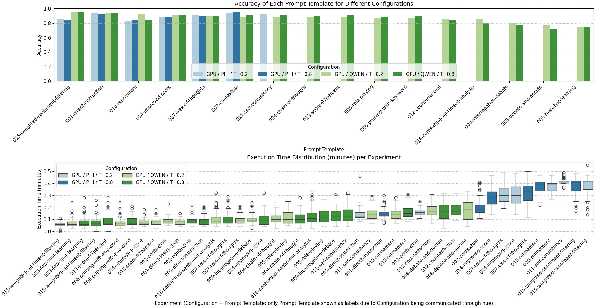

# 7 Evaluation Metrics and Analysis

## 7.1 Overview

To evaluate different models (m), temperatures (t), prompt templates (p), and devices (d)
(Experiments := m+t+p+d), we analyze **accuracy** and **execution time** for each experiment.
The analysis uses `multi_experiment_analysis.py` with additional plotting from `plotting.py`.
Running these scripts on a consolidated CSV (merging results from various experiments with 100 reviews each)
generates the key evaluation plots.

## 7.2 Key Evaluation Metrics

- **Accuracy**: Measures correct classifications for each configuration.
- **Execution Time**: Measures the computational time for each review assessment inside an experiment.

## 7.3 Final Results and Plots

The consolidated analysis generates two plots:

1. **Accuracy by Prompt Template and Configuration**:
   Shows accuracy for each prompt template by configuration (device, model, temperature) on a **linear scale**.

2. **Execution Time Distribution by Prompt Template**:
   Illustrates execution time distribution for each experiment on a **linear scale**.

The final plots are shown below:



## 7.4 Observations and Considerations

- **Execution Time**: The PHI model is slower than the QWEN model across basically all prompts and temperatures.

- **Accuracy Variance**: The `GPU / QWEN / T=0.2` with `013-score-97percent` prompt is named after an earlier batch run
  against a different subset of reviews where it scored 97% accuracy. However, here it shows 88% accuracy,
  indicating the need for larger datasets to reduce variance.

## 7.5 Performance Across Different Devices

The analysis can be extended to evaluate the impact of different devices (CPU, GPU, MPS) on execution time.
The following figure shows the significant difference in execution time when experiments are run on non-GPU
devices like MPS and Colab CPU. This plot is displayed on a **log scale** due to the vast differences in performance:


Comparing this figure to the previous one, it is evident that the execution time for experiments run on
MPS (Metal Performance Shaders on Mac) is significantly longer—nearly **100x**—compared to those run on
GPUs (both PHI and QWEN models). Similarly, running on Colab CPU takes about **30x** longer than on GPU.
This stark difference underscores the importance of using GPUs for running larger experiments
to save computational time.

The choice was made to rerun the most performant GPU experiment (`GPU / QWEN / T=0.2` with
`015-weighted-sentiment-filtering.txt`) to minimize the time needed to demonstrate this.
However, running 100 reviews on MPS still took ~9 hours and Collab CPU took ~2h40.

## 7.6 Impact of Temperature on Results

The task requires analyzing the effect of different temperature settings on sentiment classification performance.
In our experiments, we tested both low (0.2) and high (0.8) temperature settings for each model and prompt template.

Given the current experimental setup and dataset size (100 reviews per experiment), we observe a significant variance
in the accuracy results. This variance makes it challenging to draw conclusive insights regarding the impact of temperature
settings on model performance. Generally, one might expect lower temperatures to perform better in binary classification tasks,
as they promote more deterministic and less creative outputs. However, our results provide no confirmation for this.

### Key Observations:

- **High Variance**: The differences in accuracy between temperature settings (0.2 vs. 0.8) are not consistent across all prompts and models.
- **Dataset Size Limitation**: With only 100 reviews per experiment, the sample size is too small to statistically determine the temperature's impact on performance reliably.
- **Future Work Needed**: To effectively compare the impact of temperature, a much larger dataset (e.g., 1,000+ reviews per experiment) would be necessary to reduce variance and gain more reliable insights.

For the reasons above, no definitive conclusions can be made about the influence of temperature settings on sentiment classification performance in this experiment setup.

## 7.7 Running the Evaluation

Run the analysis script with:

```bash
python src/post/multi_experiment_analysis.py
```

A consolidated dataset of all experiments (approximately 11 MB) is available in the repository:
[data/gold/ALL-index=1-100.csv](data/gold/ALL-index=1-100.csv). This dataset can be used to reproduce
the analysis or generate alternative visualizations.
